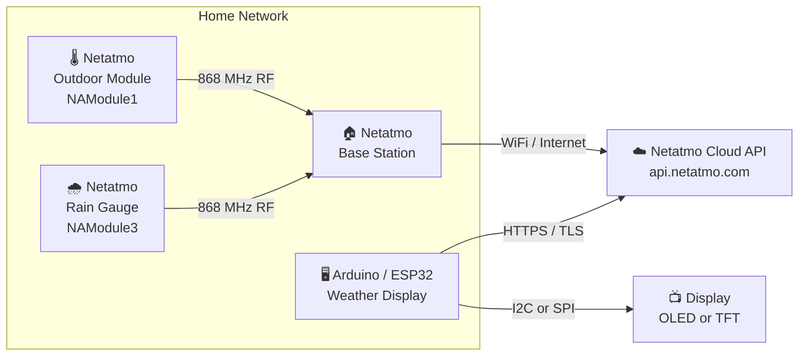
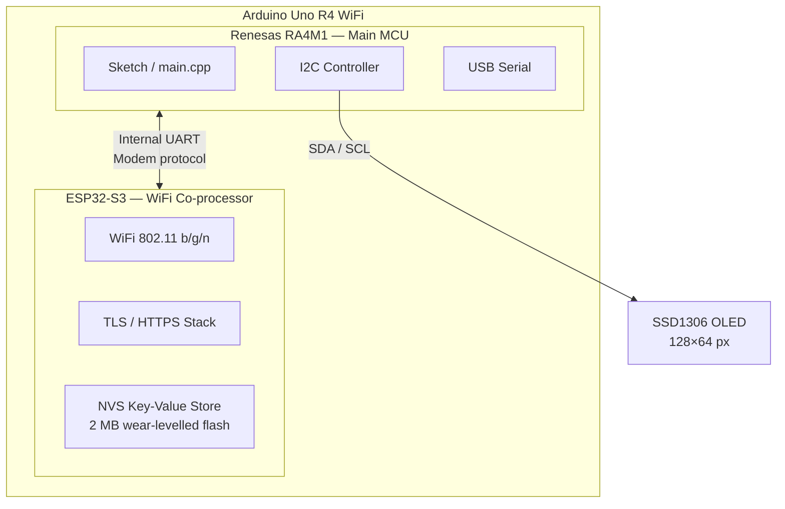
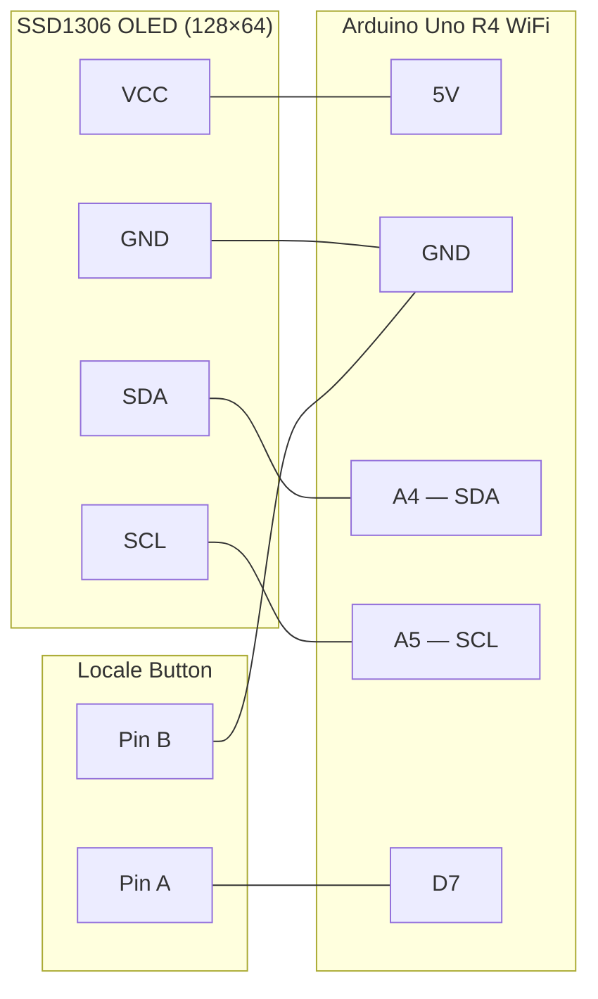
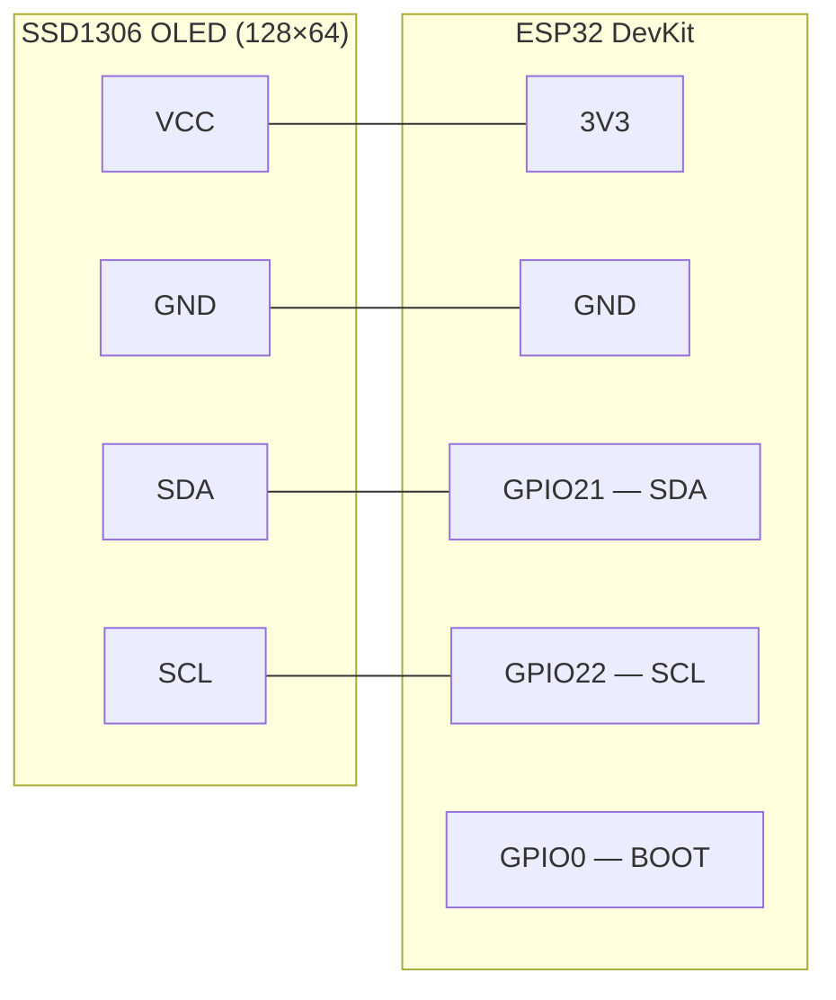
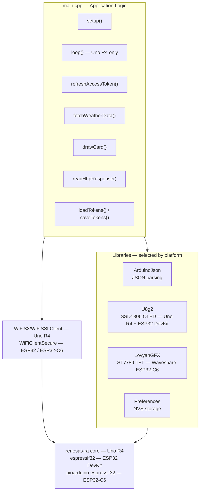
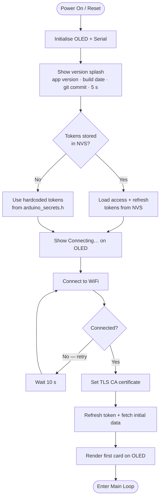
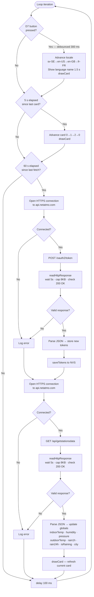
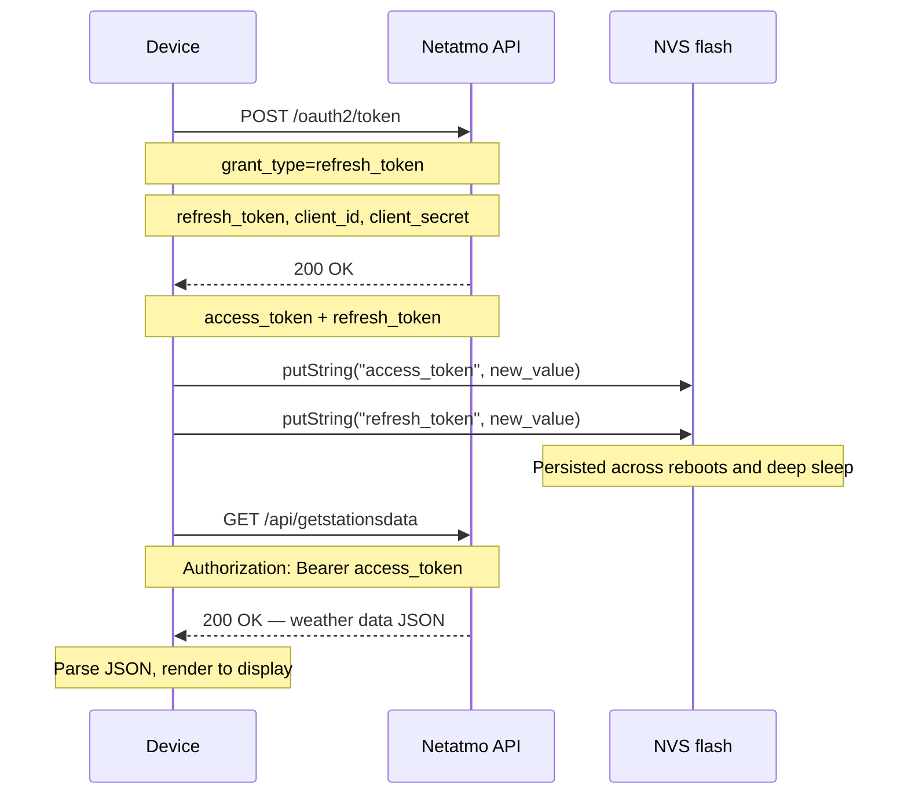
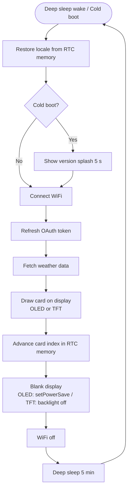

# netatmo-weather-api

An Arduino-based weather display that pulls live data from a Netatmo Weather Station and shows it on a small screen — no app or web interface needed. Supports three boards: Arduino Uno R4 WiFi (SSD1306 OLED), ESP32 DevKit (SSD1306 OLED), and Waveshare ESP32-C6 Touch LCD 1.47 (integrated 172×320 IPS TFT).

---

## System Architecture

### Overview



The outdoor module and rain gauge send sensor readings over 868 MHz RF to the base station, which uploads them to the Netatmo cloud. The display device connects independently to the Netatmo cloud API over HTTPS and fetches the aggregated data — it has no direct connection to the base station.

---

### Hardware Architecture



The RA4M1 runs the sketch. The ESP32-S3 handles all WiFi, TLS, and persistent storage. They communicate over an internal UART using an AT-style modem protocol, abstracted by the `WiFiS3` and `Preferences` libraries.

---

### Wiring — Arduino Uno R4 WiFi



| OLED pin | Arduino pin | Notes |
|---|---|---|
| VCC | 5V | Most SSD1306 breakout boards accept 3.3–5 V |
| GND | GND | |
| SDA | A4 (SDA) | Hardware I2C — pull-ups on board, no resistors needed |
| SCL | A5 (SCL) | Hardware I2C — pull-ups on board, no resistors needed |

| Button pin | Arduino pin | Notes |
|---|---|---|
| A | D7 | Internal pull-up enabled — no resistor needed |
| B | GND | |

#### Locale button

A momentary push button on **D7** cycles through the available locales at runtime. No resistor needed — the pin uses the internal pull-up.

```
D7  ──── [ button ] ──── GND
```

Each press advances: sv-SE → en-US → en-GB → fr-FR → sv-SE …

The display briefly shows the new language name before resuming the weather cards.

---

### Wiring — ESP32 DevKit



| OLED pin | ESP32 pin | Notes |
|---|---|---|
| VCC | 3V3 | **3.3 V only** — do not connect to 5V on ESP32 |
| GND | GND | |
| SDA | GPIO21 | Hardware I2C default |
| SCL | GPIO22 | Hardware I2C default |

The locale button uses the built-in **BOOT button** (GPIO0) — no external wiring needed.

#### Locale switching on ESP32

Because the ESP32 deep-sleeps between fetches, `loop()` never runs and the button cannot be polled continuously. Instead, **hold the BOOT button at power-on or during any wake cycle** to cycle the locale. The choice is stored in RTC memory and survives all subsequent deep sleeps.

---

### Wiring — Waveshare ESP32-C6 Touch LCD 1.47

The display is integrated on the board — no external display wiring is required. The SPI connection between the ESP32-C6 and the ST7789 panel is made on-board and configured in `include/esp32c6_waveshare_lcd/LGFX_config.h`.

| Signal | ESP32-C6 GPIO | Notes |
|---|---|---|
| SPI MOSI (SDA) | GPIO6 | On-board — no soldering |
| SPI SCLK (SCL) | GPIO7 | On-board — no soldering |
| CS | GPIO14 | On-board — no soldering |
| DC | GPIO15 | On-board — no soldering |
| RST | GPIO21 | On-board — no soldering |
| Backlight | GPIO22 | On-board — HIGH = on |

#### Locale switching on Waveshare ESP32-C6

Same behaviour as the ESP32 DevKit: the chip deep-sleeps between fetches. **Hold the BOOT button (GPIO9) at power-on or during any wake** to cycle the locale. The display briefly shows the new language name before continuing. The locale is stored in RTC memory.

---

### Software Stack



---

### Boot Sequence



---

### Main Loop

The loop is non-blocking. Three independent inputs are checked on every iteration:

- **Locale button** — checked first on every tick; a press cycles the locale and shows the language name for 1.5 s.
- **Card rotation** — every 5 s, advance to the next display card and call `drawCard()`.
- **Data fetch** — every 60 s, refresh the OAuth token and pull fresh weather data; the new values are stored in globals and the current card re-renders immediately.



---

### OAuth2 Token Refresh

Netatmo uses rotating refresh tokens — each successful refresh invalidates the old token and issues a new pair. The device must persist the latest tokens across reboots or it permanently loses access.



---

### Display Layout

Both display variants show the same three data cards. Labels and units reflect the active locale.

| Field | Card | Source | Unit |
|---|---|---|---|
| Indoor temp | 0 | Base station `dashboard_data.Temperature` | °C / °F |
| Indoor humidity | 0 | Base station `dashboard_data.Humidity` | % |
| Outdoor temp | 1 | NAModule1 `dashboard_data.Temperature` | °C / °F |
| Air pressure | 1 | Base station `dashboard_data.Pressure` | hPa / inHg |
| Rain 1 h | 2 | NAModule3 `dashboard_data.sum_rain_1` | mm / in |
| Rain 24 h | 2 | NAModule3 `dashboard_data.sum_rain_24` | mm / in |
| Rain-now indicator | 2 | NAModule3 `dashboard_data.Rain` > 0 | — |

---

#### SSD1306 OLED layout (Uno R4 WiFi · ESP32 DevKit) — 128×64

**Boot splash** — shown for 5 seconds:

```
┌──────────────────────────────┐
│ Netatmo Weather              │
│ v1.3                         │
│ May 13 2026                  │
│ 14244ed                      │  ← git commit hash
└──────────────────────────────┘
```

**Locale switch** — shown for 1.5 seconds:

```
┌──────────────────────────────┐
│ Language:                    │
│                              │
│  Svenska                     │  ← logisoso16 font
│                              │
│  sv-SE                       │
└──────────────────────────────┘
```

Three full-screen cards rotate every 5 seconds. Each shows a 16×16 Open Iconic weather icon, a large primary value, and a smaller secondary value.

**Card 0 — Indoor** (sun icon)
```
┌──────────────────────────────┐
│ ☀ INNE / INDOOR / INTERIEUR  │  ← locale label
│                              │
│  21.5C / 70.7F               │  ← logisoso28 font; unit per locale
│                              │
│  Fukt: 45% / Humidity: 45%   │  ← locale label
└──────────────────────────────┘
```

**Card 1 — Outdoor** (cloud icon)
```
┌──────────────────────────────┐
│ ⛅ Stockholm                  │  ← city name from Netatmo API
│                              │
│  8.3C / 46.9F                │  ← logisoso28 font; unit per locale
│                              │
│  Tryck: 1013hPa / 29.92inHg  │  ← locale label and unit
└──────────────────────────────┘
```

**Card 2 — Rain** (rain icon)
```
┌──────────────────────────────┐
│ 🌧 REGN / RAIN / PLUIE    💧 │  ← 💧 shown only when currently raining
│                              │
│  1h:  0.6mm / 0.02in         │  ← logisoso16 font; unit per locale
│                              │
│  24h: 3.2mm / 0.13in         │
└──────────────────────────────┘
```

---

#### TFT display layout (Waveshare ESP32-C6) — 320×172 landscape

**Boot splash** — shown only on cold boot (not on every deep-sleep wake):

```
┌────────────────────────────────────────────────────────────────┐
│ Netatmo Weather                                                │
│ v1.3                                                           │
│ May 13 2026                                                    │
│ 14244ed                                                        │
└────────────────────────────────────────────────────────────────┘
```

**Locale switch** — shown for 1.5 seconds when BOOT is held at wake:

```
┌────────────────────────────────────────────────────────────────┐
│ Language:                                                      │
│                                                                │
│  Svenska                                                       │
│                                                                │
│  sv-SE                                                         │
└────────────────────────────────────────────────────────────────┘
```

Three cards rotate across deep-sleep cycles (one card per wake). Each card has a coloured header bar, a large primary value, and a secondary line.

**Card 0 — Indoor** (warm amber header)
```
┌────────────────────────────────────────────────────────────────┐
│▓▓▓▓▓▓ INNE / INDOOR ▓▓▓▓▓▓▓▓▓▓▓▓▓▓▓▓▓▓▓▓▓▓▓▓▓▓▓▓ sv-SE ▓▓▓▓▓▓│
│                                                                │
│  21.5           C                                              │  ← 48px 7-segment + unit
│                                                                │
│                                                                │
│                                                                │
│  Fukt: 45% / Humidity: 45%                                     │  ← secondary line
└────────────────────────────────────────────────────────────────┘
```

**Card 1 — Outdoor** (sky-blue header)
```
┌────────────────────────────────────────────────────────────────┐
│▓▓▓▓▓▓ Stockholm ▓▓▓▓▓▓▓▓▓▓▓▓▓▓▓▓▓▓▓▓▓▓▓▓▓▓▓▓▓▓▓▓▓ sv-SE ▓▓▓▓▓▓│  ← city name
│                                                                │
│  8.3            C                                              │
│                                                                │
│                                                                │
│                                                                │
│  Tryck: 1013hPa / 29.92inHg                                    │
└────────────────────────────────────────────────────────────────┘
```

**Card 2 — Rain** (teal header)
```
┌────────────────────────────────────────────────────────────────┐
│▓▓▓▓▓▓ REGN / RAIN ▓▓▓▓▓▓▓▓▓▓▓▓▓▓▓▓▓▓▓▓▓▓▓▓▓▓▓ * sv-SE ▓▓▓▓▓▓│  ← * = raining now
│                                                                │
│  1h:  0.6mm / 0.02in                                           │  ← 26px font
│                                                                │
│  24h: 3.2mm / 0.13in                                           │
│                                                                │
│                                                                │
└────────────────────────────────────────────────────────────────┘
```

---

## Supported boards

| Board | MCU | RAM | Display | WiFi | Power model |
|---|---|---|---|---|---|
| Arduino Uno R4 WiFi | Renesas RA4M1 (Cortex-M4, 48 MHz) | 32 KB | SSD1306 128×64 OLED (external, I2C) | ESP32-S3 co-processor via `WiFiS3` | Always-on, polling loop every 60 s |
| ESP32 DevKit | Xtensa LX6, 240 MHz | 520 KB | SSD1306 128×64 OLED (external, I2C) | Native, `WiFiClientSecure` | Deep sleep 5 min between fetches |
| Waveshare ESP32-C6 Touch LCD 1.47 | ESP32-C6 (RISC-V, 160 MHz) | 512 KB | 172×320 IPS TFT, ST7789, integrated | Native WiFi 6, `WiFiClientSecure` | Deep sleep 5 min between fetches |

All boards use the `Preferences` API for NVS token storage. The Uno R4 and ESP32 DevKit use U8g2 for the OLED; the Waveshare uses LovyanGFX for the integrated TFT.

---

## Getting Started

### Prerequisites

1. PlatformIO — either the VS Code extension or the CLI (`pip install platformio`).
2. One of the supported boards:
   - **Arduino Uno R4 WiFi** + SSD1306 128×64 OLED (external, I2C)
   - **ESP32 DevKit** + SSD1306 128×64 OLED (external, I2C)
   - **Waveshare ESP32-C6 Touch LCD 1.47** (integrated display, nothing extra needed)
3. Netatmo Weather Station with a developer account and API credentials from [dev.netatmo.com](https://dev.netatmo.com).

### File structure

After cloning, your local project should look like this before building:

```
netatmo-weather-api/
├── boards/
│   └── waveshare_esp32c6_lcd.json      ← custom board definition for PlatformIO
├── include/
│   ├── uno_r4_wifi/
│   │   └── arduino_secrets.h           ← you create this for Uno R4 (gitignored)
│   ├── esp32dev/
│   │   └── arduino_secrets.h           ← you create this for ESP32 DevKit (gitignored)
│   └── esp32c6_waveshare_lcd/
│       ├── LGFX_config.h               ← LovyanGFX pin / panel configuration
│       └── arduino_secrets.h           ← you create this for Waveshare (gitignored)
├── scripts/
│   └── version.py                      ← injects git commit hash at build time
├── src/
│   └── main.cpp
├── enclosure/
│   └── enclosure.scad
└── platformio.ini
```

The secrets files are listed in `.gitignore` — they will never be pushed to GitHub, regardless of what you put in them. You create them manually using the format shown below; they are not in the repo.

### Configuration

#### Locale and units

Set your locale in `platformio.ini` under `build_flags`:

```ini
-DLOCALE=LOCALE_SV_SE
```

| Locale | Language | Temp | Pressure | Rain |
|---|---|---|---|---|
| `LOCALE_EN_US` | English (US) | °F | inHg | in |
| `LOCALE_EN_GB` | English (UK) | °C | hPa | mm |
| `LOCALE_SV_SE` | Svenska | °C | hPa | mm |
| `LOCALE_FR_FR` | Français | °C | hPa | mm |

The city name is pulled automatically from the Netatmo API and shown on the outdoor card.

#### Credentials

Create the secrets file for your board in the matching include directory:

| Board | Path |
|---|---|
| Arduino Uno R4 WiFi | `include/uno_r4_wifi/arduino_secrets.h` |
| ESP32 DevKit | `include/esp32dev/arduino_secrets.h` |
| Waveshare ESP32-C6 | `include/esp32c6_waveshare_lcd/arduino_secrets.h` |

All three files use the same format:

```cpp
#define SECRET_SSID       "YourWiFiSSID"
#define SECRET_PASS       "YourWiFiPassword"
#define ACCESS_TOKEN      "your_initial_netatmo_access_token"
#define REFRESH_TOKEN     "your_initial_netatmo_refresh_token"
#define CLIENT_ID         "your_netatmo_client_id"
#define CLIENT_SECRET     "your_netatmo_client_secret"
```

**About the credentials:**

- `CLIENT_ID` and `CLIENT_SECRET` identify your Netatmo developer app — these are the same for all devices.
- `ACCESS_TOKEN` and `REFRESH_TOKEN` must be unique per device. If two devices share the same token pair, whichever refreshes first invalidates the other's.
- You only need valid initial tokens once. After the first successful run the device saves the latest tokens to its local flash and loads them on every boot.
- Refresh tokens expire after **60 days** of inactivity. If the device has been unpowered that long, paste fresh tokens into the secrets file and reflash. The display will show `Token expired` to remind you.

### Finding the board's USB port

When you plug in the board, it appears as a serial device. To find it:

**macOS / Linux**
```bash
ls /dev/cu.usbmodem*   # macOS
ls /dev/ttyACM*        # Linux
```

Plug the board in, run the command, then unplug and run it again — the entry that disappears is your board. On macOS it typically looks like `/dev/cu.usbmodemF0F5BD51B13C2`.

**Windows**

Open Device Manager and look under **Ports (COM & LPT)** — it shows as `Arduino Uno R4 WiFi (COMx)`.

PlatformIO auto-detects the port when there is exactly one board connected. If you have multiple boards or the detection fails, pass the port explicitly:

```bash
pio run -e uno_r4_wifi --target upload --upload-port /dev/cu.usbmodemF0F5BD51B13C2
```

---

### Building and flashing

**Terminal (CLI)**

Install PlatformIO Core if you haven't already:

```bash
pip install platformio
```

Then from the project root:

```bash
# Compile only
pio run -e uno_r4_wifi            # Arduino Uno R4 WiFi
pio run -e esp32dev               # ESP32 DevKit
pio run -e esp32c6_waveshare_lcd  # Waveshare ESP32-C6 Touch LCD 1.47

# Compile and flash to the connected board
pio run -e uno_r4_wifi            --target upload
pio run -e esp32dev               --target upload
pio run -e esp32c6_waveshare_lcd  --target upload
```

The first build for each environment downloads the required toolchain and libraries automatically. The Waveshare build uses the pioarduino platform which includes arduino-esp32 3.x (~300 MB extra, one-time download).

---

### Serial monitor

The board prints boot diagnostics and runtime status over USB serial at 115200 baud. To read it:

```bash
pio device monitor -e uno_r4_wifi            # Uno R4
pio device monitor -e esp32dev               # ESP32 DevKit
pio device monitor -e esp32c6_waveshare_lcd  # Waveshare ESP32-C6
```

PlatformIO auto-detects the port. Press **Ctrl-C** to exit. You can also use any serial terminal (e.g. `screen`, `minicom`, PuTTY) pointed at the same port and baud rate:

```bash
screen /dev/cu.usbmodemF0F5BD51B13C2 115200
# Press Ctrl-A then K to exit screen
```

Typical boot output:
```
=== Boot ===
Serial OK
I2C scan:
  Device at 0x3C
  Device at 0x60
oled.begin() = true (OK)
Tokens loaded from storage
Starting...
Connecting to: YourWiFi
Tokens refreshed successfully
Tokens saved to storage
Indoor Temp: 21.50
...
```

**VS Code**

Open the project folder with the PlatformIO extension installed and use the Upload and Serial Monitor buttons in the PlatformIO toolbar.

---

## Power saving (ESP32 DevKit · Waveshare ESP32-C6)

On both ESP32 platforms the firmware uses deep sleep instead of a continuous polling loop. `setup()` runs the full fetch-and-display cycle, then puts the chip to sleep for 5 minutes. `loop()` is compiled away and never runs.

### Wake cycle



### Duty cycle

| Phase | Duration | Typical current |
|---|---|---|
| Deep sleep | ~298 s | 10–20 µA |
| WiFi connect + HTTPS fetch | ~5–8 s | 80–150 mA |

Average over a 5-minute cycle: **under 3 mA** — roughly 30–40× less than an always-on Uno R4. The ESP32 variant is suitable for battery operation.

### RTC memory

Two values survive deep sleep via `RTC_DATA_ATTR`:

| Variable | Purpose |
|---|---|
| `g_card` | Which display card to show on the next wake, so cards rotate across sleep cycles |
| `g_localeIndex` | Active locale, so locale selection persists across reboots |

OAuth tokens are stored in NVS flash (via `Preferences`) and survive both deep sleep and full power loss.

---

## Revision history

| Version | Commit | Date | Notes |
|---|---|---|---|
| v1.3 | [`14244ed`](../../commit/14244ed) | 2026-05-13 | Waveshare ESP32-C6 Touch LCD 1.47 support. Integrated 172×320 IPS display (ST7789) via LovyanGFX. Deep sleep same as ESP32 DevKit. pioarduino platform for ESP32-C6 Arduino support. |
| v1.2 | [`2b7d06a`](../../commit/2b7d06a) | 2026-05-13 | ESP32 DevKit support. Deep sleep between 5-min fetches (~3 mA average). Card and locale persist across sleeps via RTC memory. OLED blanked during sleep. |
| v1.11 | [`c47bf68`](../../commit/c47bf68) | 2026-05-10 | Runtime locale switching via push button on D7. Cycles sv-SE → en-US → en-GB → fr-FR. No recompile needed. |
| v1.1 | [`690098e`](../../commit/690098e) | 2026-05-10 | Locale support (en-US, en-GB, sv-SE, fr-FR) with unit conversions (°F/inHg/in for en-US). City name pulled from Netatmo API and shown on outdoor card. |
| v1.0 | [`f240fd0`](../../commit/f240fd0) | 2026-05-10 | First versioned release. Dropped Nano 33 IoT support — UNO R4 WiFi only. Added version splash screen showing app version, build date, and git commit hash. |
| — | [`c0b101f`](../../commit/c0b101f) | — | Initial commit. Base PlatformIO project. |

To restore a specific version locally:

```bash
git checkout f240fd0   # example: check out v1.0
```

To create a local branch from a version:

```bash
git checkout -b restore-v1.0 f240fd0
```

---

## Features

- **Live Netatmo data** — indoor temperature and humidity, outdoor temperature, air pressure, and rain totals (1 h and 24 h) fetched from the Netatmo Cloud API over HTTPS
- **3-card display** — indoor, outdoor, and rain cards rotate on every board; SSD1306 rotates every 5 s (Uno R4), TFT shows one card per wake cycle (ESP32/C6)
- **Multi-locale with unit conversion** — Svenska, English US, English UK, Français; automatically converts °C→°F, hPa→inHg, mm→in for en-US
- **Runtime locale switching** — cycle locales at any time without recompiling (button on D7 on Uno R4; BOOT button at wake on ESP32 DevKit and Waveshare ESP32-C6)
- **Three-board support** — Arduino Uno R4 WiFi (always-on polling), ESP32 DevKit (deep sleep + SSD1306), Waveshare ESP32-C6 Touch LCD 1.47 (deep sleep + integrated 172×320 IPS TFT)
- **Deep sleep (ESP32 platforms)** — chip sleeps 5 minutes between fetches; display is blanked during sleep; card rotation and locale selection persist across sleep cycles via RTC memory; average current under 3 mA
- **OAuth2 token refresh** — tokens are refreshed every cycle and written to wear-levelled NVS flash, so the device never loses API access across reboots or power cuts
- **TLS with pinned CA** — all API calls are verified against the DigiCert Global Root G2 certificate
- **Boot splash** — shows app version, build date, and git commit hash on startup
- **3D-printable enclosure** — OpenSCAD source in `enclosure/enclosure.scad`
