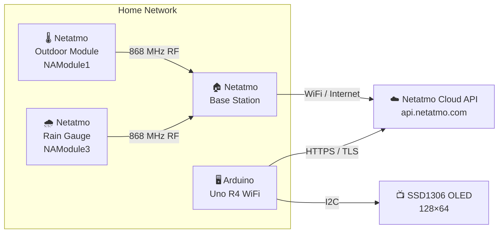
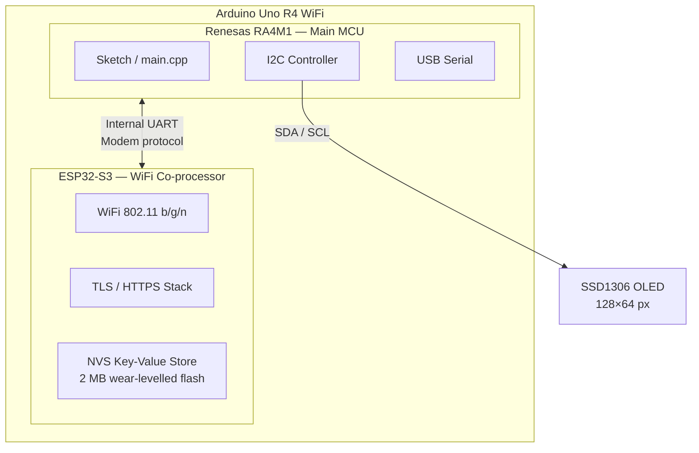
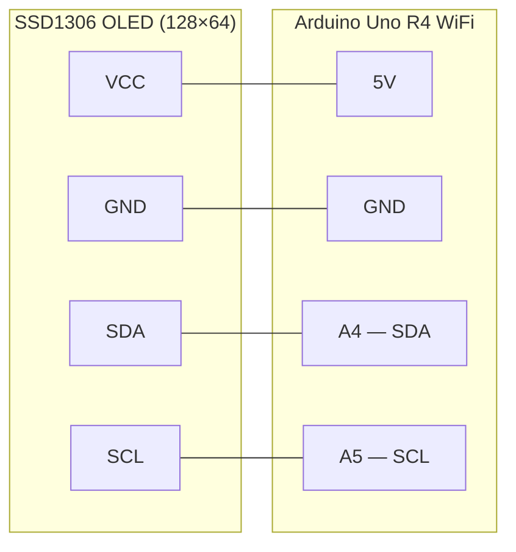
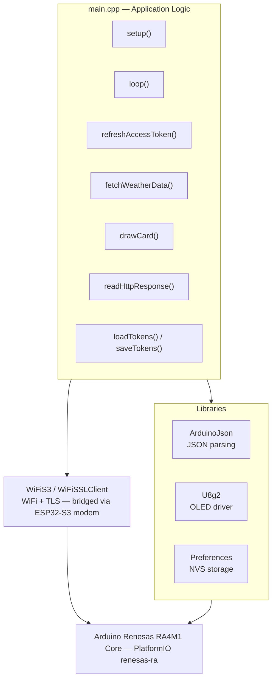
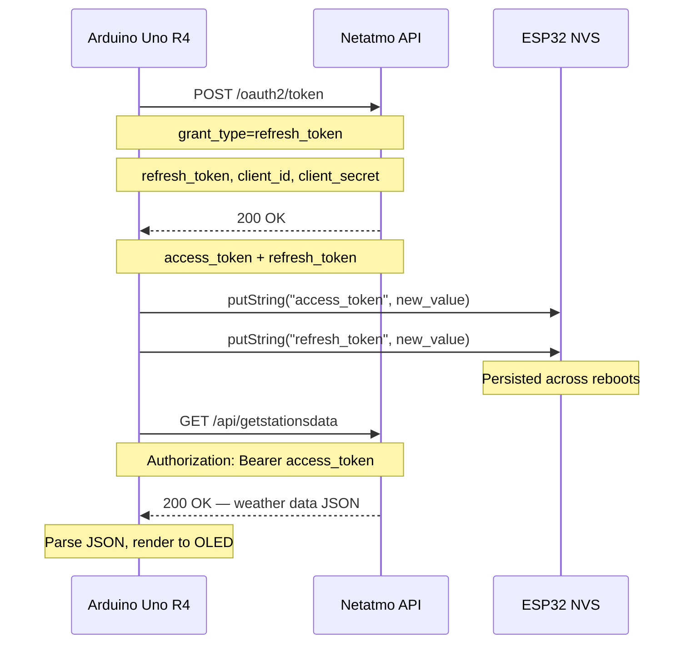

# netatmo-weather-api

An Arduino-based weather display that pulls live data from a Netatmo Weather Station and shows it on a small OLED screen — no app or web interface needed.

---

## System Architecture

### Overview



The outdoor module and rain gauge send sensor readings over 868 MHz RF to the base station, which uploads them to the Netatmo cloud. The Arduino connects independently to the Netatmo cloud API over HTTPS and fetches the aggregated data every 60 seconds — it has no direct connection to the base station.

---

### Hardware Architecture



The RA4M1 runs the sketch. The ESP32-S3 handles all WiFi, TLS, and persistent storage. They communicate over an internal UART using an AT-style modem protocol, abstracted by the `WiFiS3` and `Preferences` libraries.

---

### Wiring — Arduino Uno R4 WiFi



| OLED pin | Arduino pin | Notes |
|---|---|---|
| VCC | 5V | Most SSD1306 breakout boards accept 3.3–5 V |
| GND | GND | |
| SDA | A4 (SDA) | Hardware I2C — pull-ups on board, no resistors needed |
| SCL | A5 (SCL) | Hardware I2C — pull-ups on board, no resistors needed |

#### Locale button

A momentary push button on **D7** cycles through the available locales at runtime. No resistor needed — the pin uses the internal pull-up.

```
D7  ──── [ button ] ──── GND
```

Each press advances: sv-SE → en-US → en-GB → fr-FR → sv-SE …

The display briefly shows the new language name before resuming the weather cards.

---

### Software Stack



---

### Boot Sequence


---

### Main Loop

The loop is non-blocking. Two independent timers run on every iteration:

- **Card rotation** — every 5 s, advance to the next display card and call `drawCard()`.
- **Data fetch** — every 60 s, refresh the OAuth token and pull fresh weather data; the new values are stored in globals and the current card re-renders immediately.


---

### OAuth2 Token Refresh

Netatmo uses rotating refresh tokens — each successful refresh invalidates the old token and issues a new pair. The device must persist the latest tokens across reboots or it permanently loses access.



---

### OLED Display Layout

On boot a version splash is shown for 5 seconds:

```
┌──────────────────────────────┐
│ Netatmo Weather              │
│ v1.0                         │
│ May 10 2026                  │
│ f240fd0                      │  ← git commit hash
└──────────────────────────────┘
```

Three full-screen cards then rotate every 5 seconds. Each card shows a 16×16 Open Iconic weather icon, a large primary value, and a smaller secondary value.

**Card 0 — Indoor** (thermometer icon)
```
┌──────────────────────────────┐
│ 🌡 INDOOR                    │
│                              │
│  21.5C                       │  ← logisoso28 font
│                              │
│  Humidity: 45%               │
└──────────────────────────────┘
```

**Card 1 — Outdoor** (partly-cloudy icon)
```
┌──────────────────────────────┐
│ ⛅ OUTDOOR                   │
│                              │
│  8.3C                        │  ← logisoso28 font
│                              │
│  Pressure: 1013hPa           │
└──────────────────────────────┘
```

**Card 2 — Rain** (rain-cloud icon)
```
┌──────────────────────────────┐
│ 🌧 RAIN                   💧 │  ← 💧 shown only when currently raining
│                              │
│  1h:  0.6mm                  │  ← logisoso16 font
│                              │
│  24h: 3.2mm                  │
└──────────────────────────────┘
```

| Field | Card | Source | Unit |
|---|---|---|---|
| Indoor temp | 0 | Base station `dashboard_data.Temperature` | °C |
| Indoor humidity | 0 | Base station `dashboard_data.Humidity` | % |
| Outdoor temp | 1 | NAModule1 `dashboard_data.Temperature` | °C |
| Air pressure | 1 | Base station `dashboard_data.Pressure` | hPa |
| Rain 1 h | 2 | NAModule3 `dashboard_data.sum_rain_1` | mm |
| Rain 24 h | 2 | NAModule3 `dashboard_data.sum_rain_24` | mm |
| Rain-drop icon | 2 | NAModule3 `dashboard_data.Rain` > 0 | — |

---

## Supported board

**Arduino Uno R4 WiFi** — Renesas RA4M1 (Cortex-M4, 48 MHz), 32 KB RAM, 256 KB Flash. WiFi handled by the on-board ESP32-S3 co-processor via the `WiFiS3` library. Tokens persisted in wear-levelled NVS flash via `Preferences`.

---

## Getting Started

### Prerequisites

1. PlatformIO — either the VS Code extension or the CLI (`pip install platformio`).
2. An Arduino Uno R4 WiFi.
3. SSD1306 128×64 OLED display (I2C).
4. Netatmo Weather Station with a developer account and API credentials from [dev.netatmo.com](https://dev.netatmo.com).

### File structure

After cloning, your local project should look like this before building:

```
netatmo-weather-api/
├── include/
│   └── uno_r4_wifi/
│       └── arduino_secrets.h   ← you create this (gitignored, never pushed)
├── scripts/
│   └── version.py              ← injects git commit hash at build time
├── src/
│   └── main.cpp
├── enclosure/
│   └── enclosure.scad
└── platformio.ini
```

The secrets files are listed in `.gitignore` — they will never be pushed to GitHub, regardless of what you put in them. You create them manually; they are not in the repo.

### Configuration

#### Locale and units

Set your locale in `platformio.ini` under `build_flags`:

```ini
-DLOCALE=LOCALE_SV_SE
```

| Locale | Language | Temp | Pressure | Rain |
|---|---|---|---|---|
| `LOCALE_EN_US` | English (US) | °F | inHg | in |
| `LOCALE_EN_GB` | English (UK) | °C | hPa | mm |
| `LOCALE_SV_SE` | Svenska | °C | hPa | mm |
| `LOCALE_FR_FR` | Français | °C | hPa | mm |

The city name is pulled automatically from the Netatmo API and shown on the outdoor card.

#### Credentials

Create `include/uno_r4_wifi/arduino_secrets.h` with your credentials:

```cpp
#define SECRET_SSID       "YourWiFiSSID"
#define SECRET_PASS       "YourWiFiPassword"
#define ACCESS_TOKEN      "your_initial_netatmo_access_token"
#define REFRESH_TOKEN     "your_initial_netatmo_refresh_token"
#define CLIENT_ID         "your_netatmo_client_id"
#define CLIENT_SECRET     "your_netatmo_client_secret"
```

**About the credentials:**

- `CLIENT_ID` and `CLIENT_SECRET` identify your Netatmo developer app — these are the same for all devices.
- `ACCESS_TOKEN` and `REFRESH_TOKEN` must be unique per device. If two devices share the same token pair, whichever refreshes first invalidates the other's.
- You only need valid initial tokens once. After the first successful run the device saves the latest tokens to its local flash and loads them on every boot.
- Refresh tokens expire after **60 days** of inactivity. If the device has been unpowered that long, paste fresh tokens into the secrets file and reflash. The display will show `Token expired` to remind you.

### Finding the board's USB port

When you plug in the board, it appears as a serial device. To find it:

**macOS / Linux**
```bash
ls /dev/cu.usbmodem*   # macOS
ls /dev/ttyACM*        # Linux
```

Plug the board in, run the command, then unplug and run it again — the entry that disappears is your board. On macOS it typically looks like `/dev/cu.usbmodemF0F5BD51B13C2`.

**Windows**

Open Device Manager and look under **Ports (COM & LPT)** — it shows as `Arduino Uno R4 WiFi (COMx)`.

PlatformIO auto-detects the port when there is exactly one board connected. If you have multiple boards or the detection fails, pass the port explicitly:

```bash
pio run -e uno_r4_wifi --target upload --upload-port /dev/cu.usbmodemF0F5BD51B13C2
```

---

### Building and flashing

**Terminal (CLI)**

Install PlatformIO Core if you haven't already:

```bash
pip install platformio
```

Then from the project root:

```bash
# Compile only — produces .pio/build/uno_r4_wifi/firmware.bin
pio run -e uno_r4_wifi

# Compile and flash to the connected board
pio run -e uno_r4_wifi --target upload
```

The first build downloads all required toolchains and libraries automatically (~500 MB, one-time). Subsequent builds are incremental and take a few seconds.

---

### Serial monitor

The board prints boot diagnostics and runtime status over USB serial at 115200 baud. To read it:

```bash
pio device monitor -e uno_r4_wifi
```

PlatformIO auto-detects the port. Press **Ctrl-C** to exit. You can also use any serial terminal (e.g. `screen`, `minicom`, PuTTY) pointed at the same port and baud rate:

```bash
screen /dev/cu.usbmodemF0F5BD51B13C2 115200
# Press Ctrl-A then K to exit screen
```

Typical boot output:
```
=== Boot ===
Serial OK
I2C scan:
  Device at 0x3C
  Device at 0x60
oled.begin() = true (OK)
Tokens loaded from storage
Starting...
Connecting to: YourWiFi
Tokens refreshed successfully
Tokens saved to storage
Indoor Temp: 21.50
...
```

**VS Code**

Open the project folder with the PlatformIO extension installed and use the Upload and Serial Monitor buttons in the PlatformIO toolbar.

---

## Revision history

| Version | Commit | Date | Notes |
|---|---|---|---|
| v1.11 | [`c47bf68`](../../commit/c47bf68) | 2026-05-10 | Runtime locale switching via push button on D7. Cycles sv-SE → en-US → en-GB → fr-FR. No recompile needed. |
| v1.1 | [`690098e`](../../commit/690098e) | 2026-05-10 | Locale support (en-US, en-GB, sv-SE, fr-FR) with unit conversions (°F/inHg/in for en-US). City name pulled from Netatmo API and shown on outdoor card. |
| v1.0 | [`f240fd0`](../../commit/f240fd0) | 2026-05-10 | First versioned release. Dropped Nano 33 IoT support — UNO R4 WiFi only. Added version splash screen showing app version, build date, and git commit hash. |
| — | [`c0b101f`](../../commit/c0b101f) | — | Initial commit. Base PlatformIO project. |

To restore a specific version locally:

```bash
git checkout f240fd0   # example: check out v1.0
```

To create a local branch from a version:

```bash
git checkout -b restore-v1.0 f240fd0
```

---

## Missing features

- [X] Refresh the access token and persist it across reboots.
- [X] OLED display showing live weather data.
- [X] Design a case for the display. See `enclosure/enclosure.scad`.
