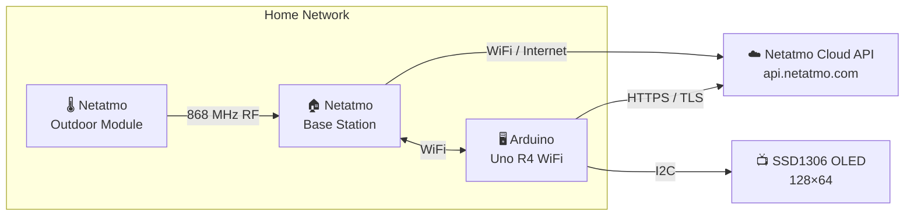
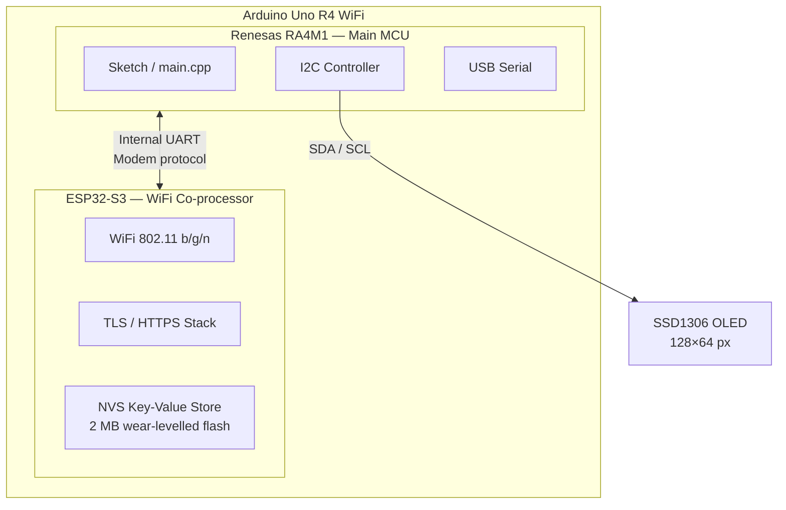
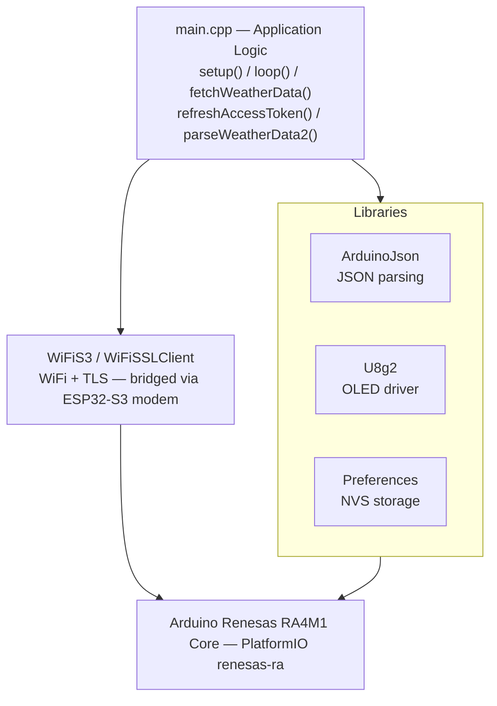
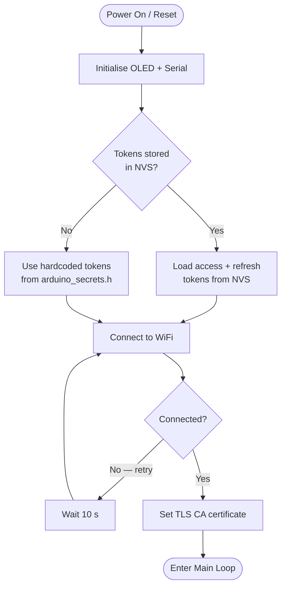
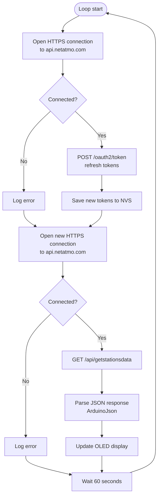
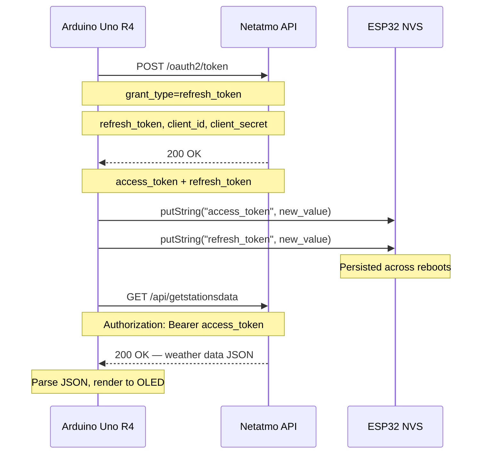

# netatmo-weather-api

An Arduino-based weather display that pulls live data from a Netatmo Weather Station and shows it on a small OLED screen — no app or web interface needed.

---

## System Architecture

### Overview



The Arduino and the Netatmo base station are both on your home network. The outdoor module sends sensor readings over 868 MHz RF to the base station, which uploads them to the Netatmo cloud. The Arduino fetches the aggregated data from the cloud API every 60 seconds.

---

### Hardware Architecture



The RA4M1 runs the sketch. The ESP32-S3 handles all WiFi, TLS, and persistent storage. They communicate over an internal UART using an AT-style modem protocol, abstracted by the `WiFiS3` and `Preferences` libraries.

---

### Software Stack



---

### Boot Sequence



---

### Main Loop



---

### OAuth2 Token Refresh

Netatmo uses rotating refresh tokens — each successful refresh invalidates the old token and issues a new pair. The device must persist the latest tokens across reboots or it permanently loses access.



---

### OLED Display Layout

```
┌──────────────────────────────┐
│ IndoorTemp:     21.5         │
│ IndoorHumidity: 45           │
│ AirPressure:    1013.2       │
│ OutdoorTemp:    8.3          │
│                              │
│                              │
│                              │
└──────────────────────────────┘
        128 × 64 pixels
```

| Field | Source | Unit |
|---|---|---|
| IndoorTemp | Base station dashboard_data | °C |
| IndoorHumidity | Base station dashboard_data | % |
| AirPressure | Base station dashboard_data | hPa |
| OutdoorTemp | Outdoor module dashboard_data | °C |

---

## Getting Started

### Prerequisites

1. Visual Studio Code with PlatformIO installed.
2. Arduino Uno R4 WiFi.
3. SSD1306 128×64 OLED display (I2C).
4. Netatmo Weather Station with a developer account and API credentials from [dev.netatmo.com](https://dev.netatmo.com).

### Configuration

Credentials are stored in `include/arduino_secrets.h`, which is excluded from version control. Create it with the following content:

```cpp
#define SECRET_SSID       "YourWiFiSSID"
#define SECRET_PASS       "YourWiFiPassword"
#define ACCESS_TOKEN      "your_initial_netatmo_access_token"
#define REFRESH_TOKEN     "your_initial_netatmo_refresh_token"
#define CLIENT_ID         "your_netatmo_client_id"
#define CLIENT_SECRET     "your_netatmo_client_secret"
```

You only need valid initial tokens once. After the first successful run the device persists the latest tokens to NVS and loads them on every subsequent boot.

### Building and flashing

Open the project folder in VS Code with PlatformIO. Select the `uno_r4_wifi` environment and click **Upload**.

---

## Missing features

- [X] Refresh the access token and persist it across reboots.
- [X] OLED display showing live weather data.
- [ ] Design a case for the display.
