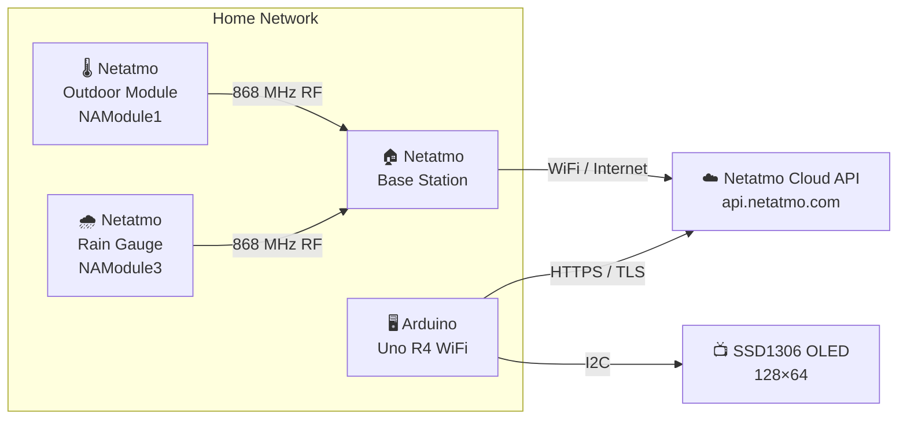
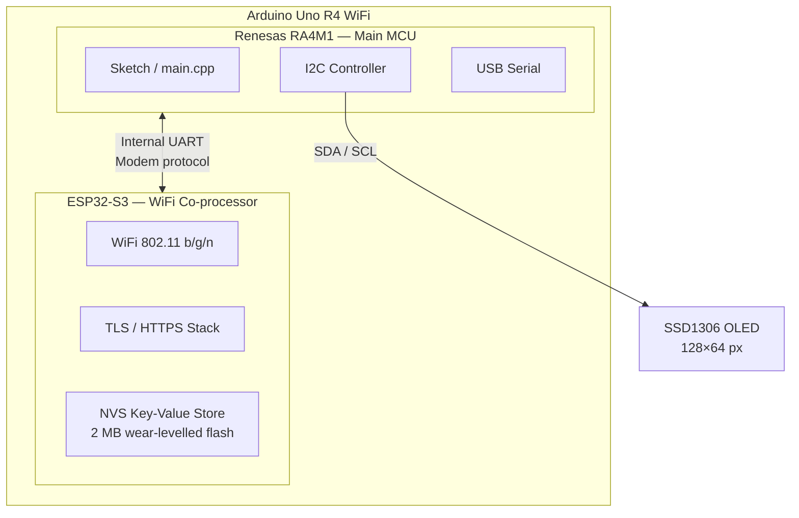
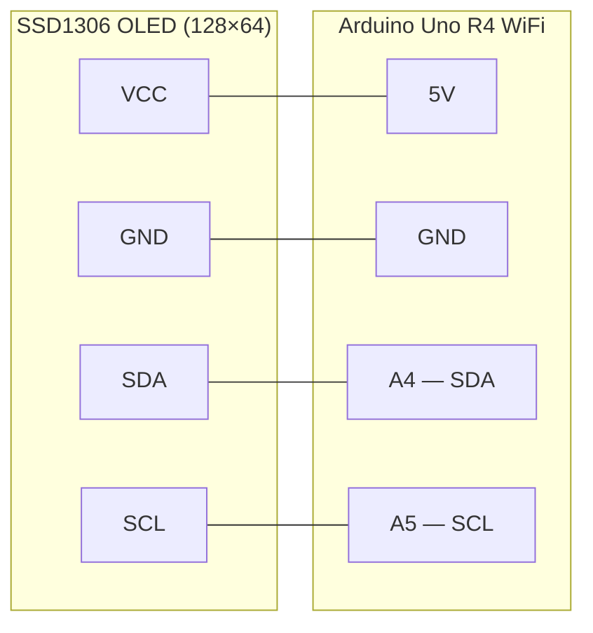
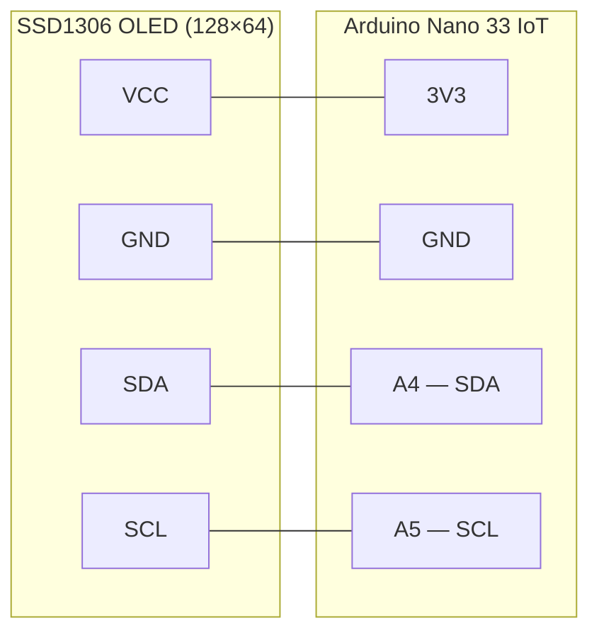
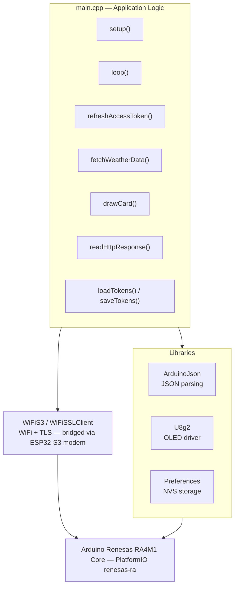
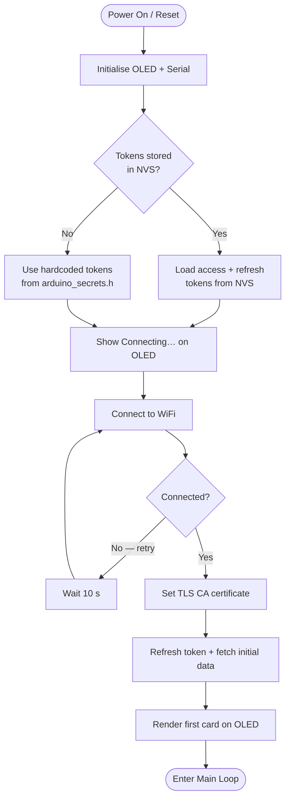
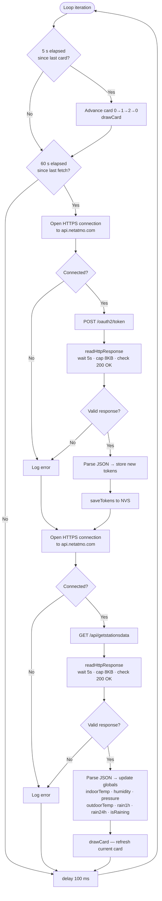
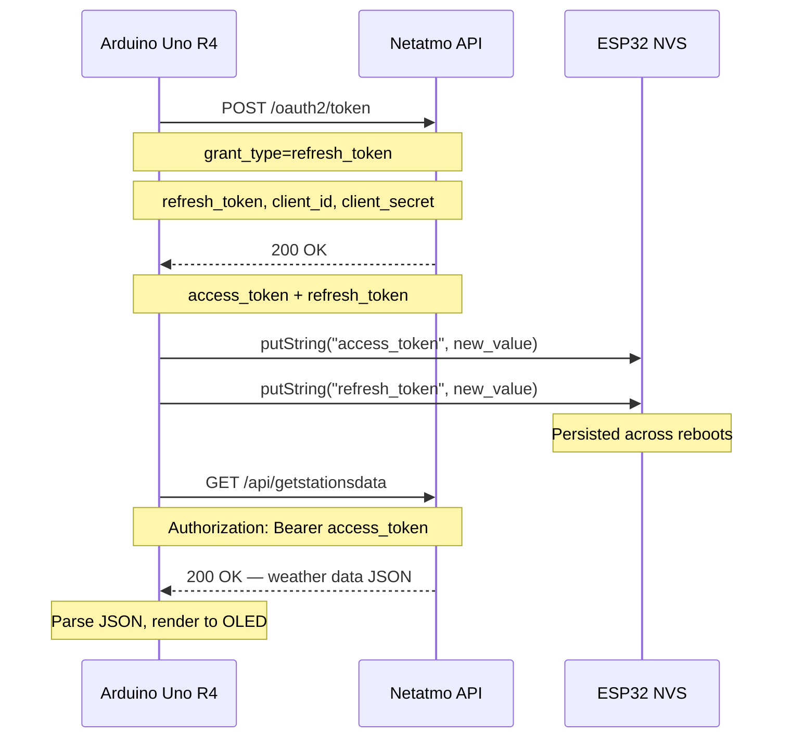

# netatmo-weather-api

An Arduino-based weather display that pulls live data from a Netatmo Weather Station and shows it on a small OLED screen — no app or web interface needed.

---

## System Architecture

### Overview



The outdoor module and rain gauge send sensor readings over 868 MHz RF to the base station, which uploads them to the Netatmo cloud. The Arduino connects independently to the Netatmo cloud API over HTTPS and fetches the aggregated data every 60 seconds — it has no direct connection to the base station.

---

### Hardware Architecture



The RA4M1 runs the sketch. The ESP32-S3 handles all WiFi, TLS, and persistent storage. They communicate over an internal UART using an AT-style modem protocol, abstracted by the `WiFiS3` and `Preferences` libraries.

---

### Wiring — Arduino Uno R4 WiFi



| OLED pin | Arduino pin | Notes |
|---|---|---|
| VCC | 5V | Most SSD1306 breakout boards accept 3.3–5 V |
| GND | GND | |
| SDA | A4 (SDA) | Hardware I2C — pull-ups on board, no resistors needed |
| SCL | A5 (SCL) | Hardware I2C — pull-ups on board, no resistors needed |

---

### Wiring — Arduino Nano 33 IoT

> **3.3 V only.** The Nano 33 IoT is not 5 V tolerant on any pin. Power the OLED from **3V3**, not 5V.



| OLED pin | Arduino pin | Notes |
|---|---|---|
| VCC | 3V3 | Do **not** use 5V — the Nano 33 IoT is 3.3 V only |
| GND | GND | |
| SDA | A4 (SDA) | Hardware I2C — pull-ups on board, no resistors needed |
| SCL | A5 (SCL) | Hardware I2C — pull-ups on board, no resistors needed |

Default I2C address: `0x3C` (some modules use `0x3D` — check the silkscreen).

---

### Software Stack



---

### Boot Sequence



---

### Main Loop

The loop is non-blocking. Two independent timers run on every iteration:

- **Card rotation** — every 5 s, advance to the next display card and call `drawCard()`.
- **Data fetch** — every 60 s, refresh the OAuth token and pull fresh weather data; the new values are stored in globals and the current card re-renders immediately.



---

### OAuth2 Token Refresh

Netatmo uses rotating refresh tokens — each successful refresh invalidates the old token and issues a new pair. The device must persist the latest tokens across reboots or it permanently loses access.



---

### OLED Display Layout

Three full-screen cards rotate every 5 seconds. Each card shows a 16×16 Open Iconic weather icon, a large primary value, and a smaller secondary value.

**Card 0 — Indoor** (thermometer icon)
```
┌──────────────────────────────┐
│ 🌡 INDOOR                    │
│                              │
│  21.5C                       │  ← logisoso28 font
│                              │
│  Humidity: 45%               │
└──────────────────────────────┘
```

**Card 1 — Outdoor** (partly-cloudy icon)
```
┌──────────────────────────────┐
│ ⛅ OUTDOOR                   │
│                              │
│  8.3C                        │  ← logisoso28 font
│                              │
│  Pressure: 1013hPa           │
└──────────────────────────────┘
```

**Card 2 — Rain** (rain-cloud icon)
```
┌──────────────────────────────┐
│ 🌧 RAIN                   💧 │  ← 💧 shown only when currently raining
│                              │
│  1h:  0.6mm                  │  ← logisoso16 font
│                              │
│  24h: 3.2mm                  │
└──────────────────────────────┘
```

| Field | Card | Source | Unit |
|---|---|---|---|
| Indoor temp | 0 | Base station `dashboard_data.Temperature` | °C |
| Indoor humidity | 0 | Base station `dashboard_data.Humidity` | % |
| Outdoor temp | 1 | NAModule1 `dashboard_data.Temperature` | °C |
| Air pressure | 1 | Base station `dashboard_data.Pressure` | hPa |
| Rain 1 h | 2 | NAModule3 `dashboard_data.sum_rain_1` | mm |
| Rain 24 h | 2 | NAModule3 `dashboard_data.sum_rain_24` | mm |
| Rain-drop icon | 2 | NAModule3 `dashboard_data.Rain` > 0 | — |

---

## Supported boards

| | Arduino Uno R4 WiFi | Arduino Nano 33 IoT |
|---|---|---|
| MCU | Renesas RA4M1 (Cortex-M4, 48 MHz) | Microchip SAMD21 (Cortex-M0+, 48 MHz) |
| RAM / Flash | 32 KB / 256 KB | 32 KB / 256 KB |
| WiFi chip | ESP32-S3 (co-processor) | u-blox NINA-W102 (ESP32) |
| WiFi library | `WiFiS3` | `WiFiNINA` |
| Token storage | `Preferences` (NVS wear-levelled flash) | `FlashStorage_SAMD` (emulated EEPROM) |
| TLS CA cert | Set explicitly via `setCACert()` | Uses NINA firmware's built-in CA store |
| Logic voltage | 3.3 V (5 V tolerant) | **3.3 V only** |
| PlatformIO env | `uno_r4_wifi` | `nano33iot` |

All application logic, display code, and API communication are shared between both targets via `#ifdef ARDUINO_ARCH_RENESAS` / `#ifdef ARDUINO_ARCH_SAMD` guards in `main.cpp`.

> **Nano 33 IoT wiring note:** The board is 3.3 V only — power the OLED from the **3V3** pin, not 5V. Most SSD1306 breakout boards accept 3.3 V on VCC without modification.

> **Nano 33 IoT firmware note:** Keep the NINA firmware up to date (`Tools → Update Firmware` in the Arduino IDE) so the built-in CA store is current.

---

## Getting Started

### Prerequisites

1. Visual Studio Code with PlatformIO installed.
2. An Arduino Uno R4 WiFi **or** Arduino Nano 33 IoT.
3. SSD1306 128×64 OLED display (I2C).
4. Netatmo Weather Station with a developer account and API credentials from [dev.netatmo.com](https://dev.netatmo.com).

### Configuration

Credentials are stored in `include/arduino_secrets.h`, which is excluded from version control. Create it with the following content:

```cpp
#define SECRET_SSID       "YourWiFiSSID"
#define SECRET_PASS       "YourWiFiPassword"
#define ACCESS_TOKEN      "your_initial_netatmo_access_token"
#define REFRESH_TOKEN     "your_initial_netatmo_refresh_token"
#define CLIENT_ID         "your_netatmo_client_id"
#define CLIENT_SECRET     "your_netatmo_client_secret"
```

You only need valid initial tokens once. After the first successful run the device persists the latest tokens to flash and loads them on every subsequent boot.

### Building and flashing

Open the project folder in VS Code with PlatformIO. Select the environment that matches your board from the PlatformIO toolbar, then click **Upload**:

| Board | Environment |
|---|---|
| Arduino Uno R4 WiFi | `uno_r4_wifi` |
| Arduino Nano 33 IoT | `nano33iot` |

Or from the command line:

```bash
# Uno R4 WiFi
pio run -e uno_r4_wifi --target upload

# Nano 33 IoT
pio run -e nano33iot --target upload
```

---

## Missing features

- [X] Refresh the access token and persist it across reboots.
- [X] OLED display showing live weather data.
- [X] Design a case for the display. See `enclosure/enclosure.scad`.
