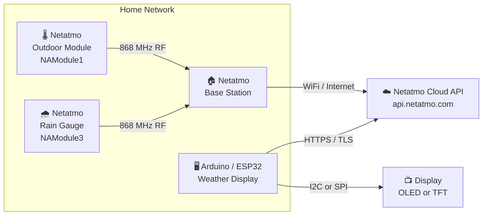
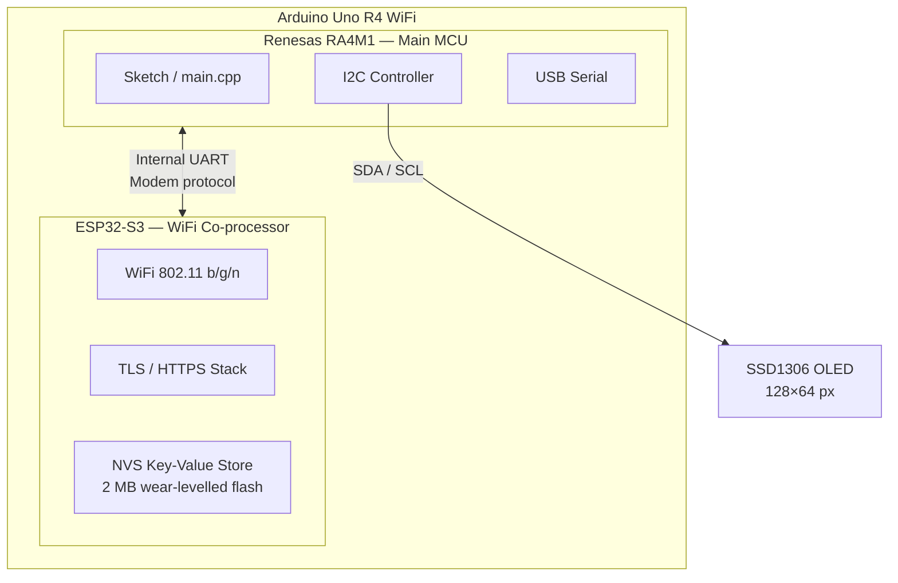
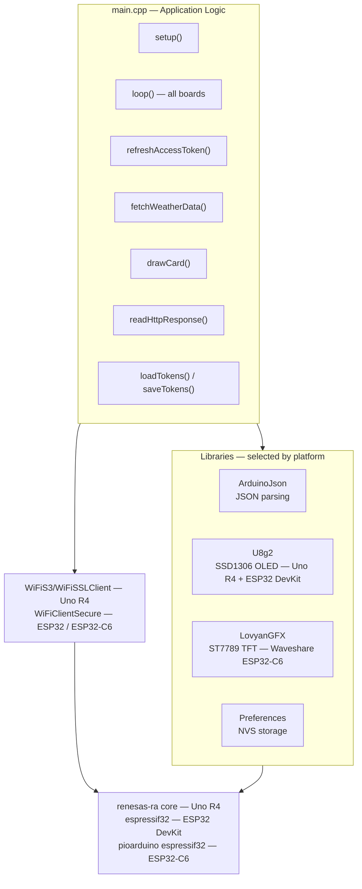
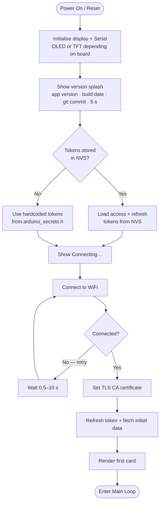
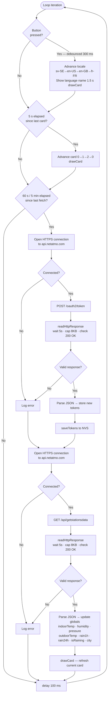
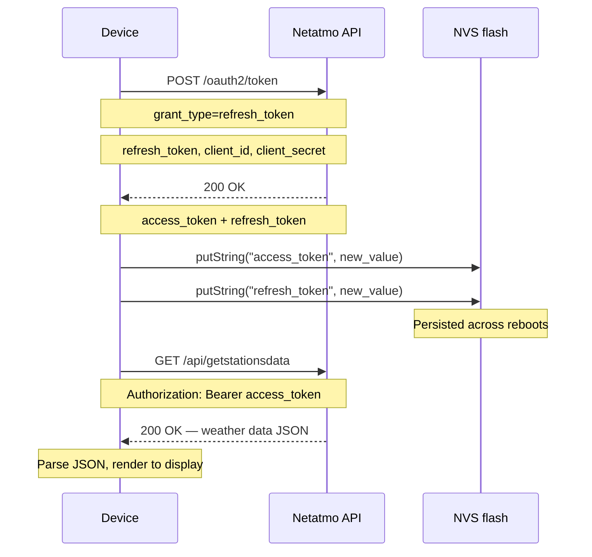

# Architecture

## System Overview

The outdoor module and rain gauge send sensor readings over 868 MHz RF to the base station, which uploads them to the Netatmo cloud. The display device connects independently to the Netatmo cloud API over HTTPS and fetches the aggregated data — it has no direct connection to the base station.

---

## Hardware Architecture

The RA4M1 runs the sketch. The ESP32-S3 handles all WiFi, TLS, and persistent storage. They communicate over an internal UART using an AT-style modem protocol, abstracted by the `WiFiS3` and `Preferences` libraries.

---

## Software Stack

---

## Boot Sequence

---

## Main Loop

All three boards run the same non-blocking polling loop. Three independent inputs are checked on every iteration:

- **Locale button** — a press cycles the locale and shows the language name for 1.5 s. Debounced at 300 ms.
- **Card rotation** — every 5 s, advance to the next display card and call `drawCard()`.
- **Data fetch** — every **60 s** (Uno R4) or **5 min** (ESP32 / ESP32-C6), refresh the OAuth token and pull fresh weather data; the current card re-renders immediately.

---

## OAuth2 Token Refresh

Netatmo uses rotating refresh tokens — each successful refresh invalidates the old token and issues a new pair. The device must persist the latest tokens across reboots or it permanently loses access.

