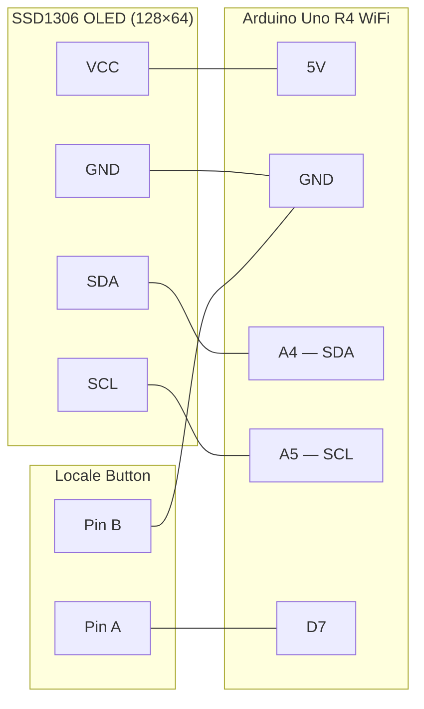
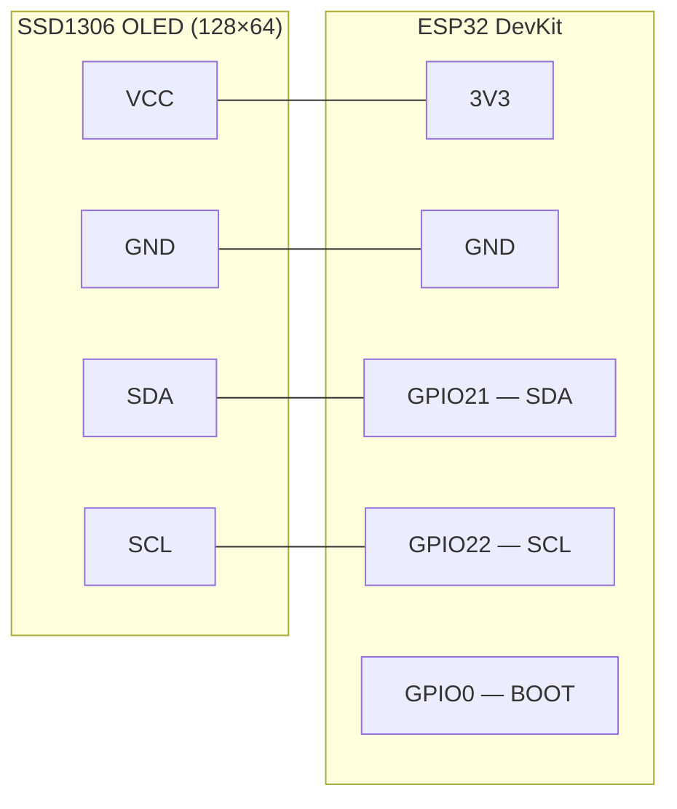
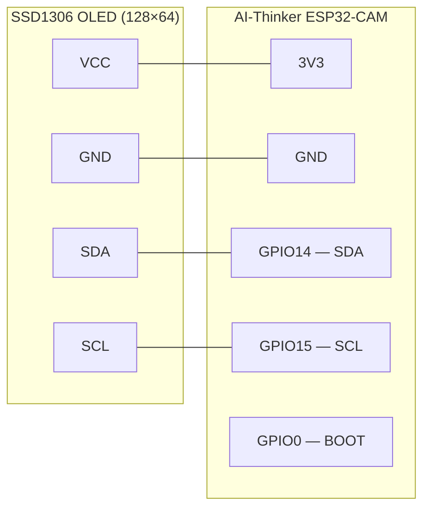

# Wiring

## Arduino Uno R4 WiFi



| OLED pin | Arduino pin | Notes |
|---|---|---|
| VCC | 5V | Most SSD1306 breakout boards accept 3.3–5 V |
| GND | GND | |
| SDA | A4 (SDA) | Hardware I2C — pull-ups on board, no resistors needed |
| SCL | A5 (SCL) | Hardware I2C — pull-ups on board, no resistors needed |

| Button pin | Arduino pin | Notes |
|---|---|---|
| A | D7 | Internal pull-up enabled — no resistor needed |
| B | GND | |

### Locale button

A momentary push button on **D7** cycles through the available locales at runtime. No resistor needed — the pin uses the internal pull-up.

```
D7  ──── [ button ] ──── GND
```

Each press advances: sv-SE → en-US → en-GB → fr-FR → sv-SE …

The display briefly shows the new language name before resuming the weather cards.

---

## ESP32 DevKit



| OLED pin | ESP32 pin | Notes |
|---|---|---|
| VCC | 3V3 | **3.3 V only** — do not connect to 5V on ESP32 |
| GND | GND | |
| SDA | GPIO21 | Hardware I2C default |
| SCL | GPIO22 | Hardware I2C default |

The locale button uses the built-in **BOOT button** (GPIO0) — no external wiring needed.

### Locale switching on ESP32

Press the **BOOT button (GPIO0)** at any time to cycle the locale. The display briefly shows the new language name before resuming the weather cards.

---

## AI-Thinker ESP32-CAM



| OLED pin | ESP32-CAM pin | Notes |
|---|---|---|
| VCC | 3V3 | **3.3 V only** |
| GND | GND | |
| SDA | GPIO14 | Camera HREF pin — repurposed for I2C |
| SCL | GPIO15 | Camera PCLK pin — repurposed for I2C |

The locale button uses the built-in **BOOT button** (GPIO0) — no external wiring needed.

> **Note:** GPIO14 and GPIO15 are camera interface pins. They are safe to use for I2C when the camera module is not in use, which is always the case for this sketch.

> **Flashing:** The ESP32-CAM has no built-in auto-reset circuit. To flash, connect IO0 → GND and press RST (or power-cycle) before starting the upload. Disconnect IO0 from GND after flashing.

### Locale switching on ESP32-CAM

Press the **BOOT button (GPIO0)** at any time to cycle the locale. The display briefly shows the new language name before resuming the weather cards.

---

## Waveshare ESP32-C6 Touch LCD 1.47

The display is integrated on the board — no external display wiring is required. The SPI connection between the ESP32-C6 and the ST7789 panel is made on-board and configured in `include/esp32c6_waveshare_lcd/LGFX_config.h`.

| Signal | ESP32-C6 GPIO | Notes |
|---|---|---|
| SPI MOSI (SDA) | GPIO6 | On-board — no soldering |
| SPI SCLK (SCL) | GPIO7 | On-board — no soldering |
| CS | GPIO14 | On-board — no soldering |
| DC | GPIO15 | On-board — no soldering |
| RST | GPIO21 | On-board — no soldering |
| Backlight | GPIO22 | On-board — HIGH = on |

### Locale switching on Waveshare ESP32-C6

Press the **BOOT button (GPIO9)** at any time to cycle the locale. The display briefly shows the new language name before resuming the weather cards.
